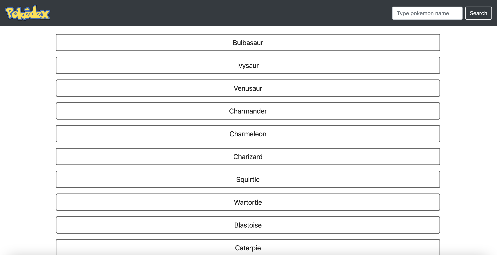
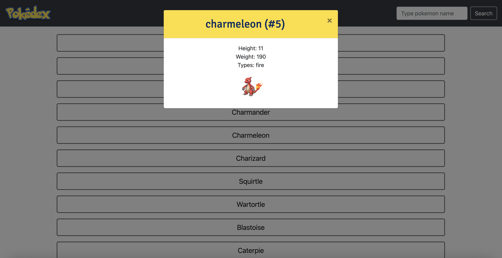

# JavaScript App (Pokédex)

## Description
This web application is built with HTML, CSS, and Javascript that loads data from an external API and enables the viewing of data points in detail. It shows the first 150 Pokémon. Clicking on Pokémon name opens a modal, displaying further details of the Pokémon. The modal can be closed by clicking on the 'x', outside the modal window or pressing the 'ESC' key.
The search function in the navigation bar allows searching for Pokémon names, displaying all names that match the criteria entered in the search field. (The search button however does not work)

## Dependencies
- jQuery
- Bootstrap
- [Pokemon API](https://pokeapi.co/api/v2/pokemon/?limit=20)
- Ajax
- Fetch polyfill
- Promise polyfill

## Technologies used
- HTML
- CSS
- JavaScript

## Project screenshots

Pokémon names:

Pokémon modal:

## Project Repository
[simple-js-app](https://github.com/netti-w/simple-js-app)

## Project link
[Pokédex App](https://netti-w.github.io/simple-js-app/)
